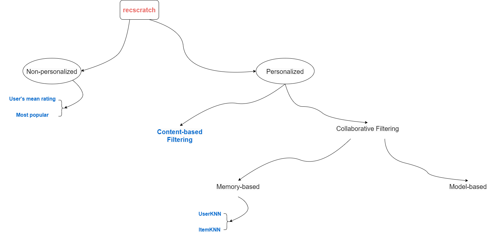

# recscratch: recommendation from scratch

## Introduction
This recscratch framework (i.e. recommendation from scratch) provides implementations of various basic recommendation algorithms. It aims to provide a comprehensive collection of algorithms for recommendation methods such as non personalized, Content-based Filtering, Collaborative Filtering, and more. The project utilizes Python 3.10.

The recscratch reconstructs the methods for the basic recommendation methods for the purpose of learning and better understanding how recommendation systems work.

This project was built by [MinhNguyenDS](https://github.com/MinhNguyenDS)

## Table of Contents
- [recscratch: recommendation from scratch](#recscratch-recommendation-from-scratch)
  - [Introduction](#introduction)
  - [Table of Contents](#table-of-contents)
  - [Methods overview](#methods-overview)
    - [Dependencies and Installation](#dependencies-and-installation)
    - [Example usage](#example-usage)
      - [Processing](#processing)
      - [MeanRating, MostPop](#meanrating-mostpop)
      - [Content-based Filtering](#content-based-filtering)
      - [Collaborative Filtering](#collaborative-filtering)
  - [Contributing](#contributing)
  - [Credits](#credits)
  - [References](#references)
  - [License](#license)

## Methods overview



### Dependencies and Installation

To install the project and its dependencies, follow these steps:

1. Clone the repository to your local machine:
``` 
git clone https://github.com/MinhNguyenDS/recscratch.git
```

2. Install the required dependencies by running the following command:
```
pip install -r requirements.txt
```

3. Once the installation is complete, you can proceed to the usage section.
   

### Example usage

***Note:*** If you want to run 3 file: non_personalized.py, content_based.py, memory_based.py. You have to change ***recscratch.utils.processing*** => ***utils.processing***. After that, run code below:

    cd recscratch
    python non_personalized.py

#### Processing

    python recscratch/utils/processing.py data_example/Book Ratings.csv Books.csv

#### MeanRating, MostPop

```python

# local library
from recscratch.utils.processing import content_processing, rating_processing
from recscratch.non_personalized import MeanRating, MostPop

## Movielens dataset ##
X_train, X_test = rating_processing("data_example/Movielens/ml-latest-small", "ratings.csv", "userId", "movieId", "rating", 0.998, 22)
ratings = rating_processing("data_example/Movielens/ml-latest-small", "ratings.csv" , "userId", "movieId", "rating")

## MeanRating ## 
RatPred = MeanRating()
users_ratings = RatPred.avg_calculate(X_train)
predictions = RatPred.get_recommendations(X_test)
print(predictions)
#      userid  itemid  rating  AvgRating
# 0        43      95     4.0   4.553571
# 1        43     788     5.0   4.553571
# 2       263    2724     3.0   3.720096
# ...

## MostPop ##
mostpop = MostPop()
item_count = mostpop.item_count(X_train[:1000])
predictions = mostpop.get_recommendations(X_test)
print(predictions)
#         itemid  Count  userid
# 0         4878      7      43
# 1         4878      7     263
# 2         4878      7     186
# ...
```

#### Content-based Filtering

```python

# local library
from recscratch.utils.processing import content_processing, rating_processing
from recscratch.content_based import ContentBased

## Movielens dataset ##
# Use 'overview' column for content-based recommendation
movies = content_processing("data_example/Movielens/ml-latest-small", "movies_metadata_test.csv", ['title', 'overview'])

## Content based ##
content_based = ContentBased()
list_data_processed = content_based.processing_on_list(movies['overview'])
tfidf_feature = content_based.fit_tfidf(list_data_processed)
cosine_sim_matrix = content_based.fit_similarity_all_data(tfidf_feature)
item2item_encoded = content_based.indexing_item(movies,'title')
recommendation = content_based.get_recommendations("Father of the Bride Part II", cosine_sim_matrix, item2item_encoded)
print(recommendation)
# ['Nine Months', 'The Madness of King George', 'Nina Takes a Lover', 'The War Room', 'Killer', "My Mother's Courage", 'The Philadelphia Story', 'Father of the Bride', "It's a Wonderful Life"]
```

#### Collaborative Filtering

```python

# local library
from recscratch.utils.processing import content_processing, rating_processing
from recscratch.memory_based import UserKNN, ItemKNN

## Movielens dataset ##
X_train, X_test = rating_processing("data_example/Movielens/ml-latest-small", "ratings.csv", "userId", "movieId", "rating", 0.998, 22)

# Collaborative Filtering UserKNN ##
userKNN = UserKNN(X_train)
recommendation = userKNN.get_recommendations(1, 100, sim_name='cosine', topK=10)
print(recommendation)
# [(rating, itemid)]
# [(5.000000000000001, 141718), (5.000000000000001, 128360), (5.000000000000001, 71462), (5.000000000000001, 44195), (5.000000000000001, 5225), (5.000000000000001, 4967), (5.000000000000001, 1237), (5.000000000000001, 741), (5.0, 185135), (5.0, 180095)]

# Collaborative Filtering UserKNN ##
itemKNN = ItemKNN(X_train)
recommendation = itemKNN.get_recommendations(1, 100, sim_name='pearson', topK=10)
print(recommendation)
# [(rating, itemid)]
# [(5.0, 607), (5.0, 607), (5.0, 594), (5.0, 594), (5.0, 578), (5.0, 578), (5.0, 573), (5.0, 573), (5.0, 492), (5.0, 492)]
```

## Contributing

This repository is intended for educational purposes and does not accept further contributions. Feel free to utilize and enhance the library based on your own requirements.


## Credits
- Movielens Dataset, see <https://grouplens.org/datasets/movielens/>
- Book Recommendation Dataset, see <https://www.kaggle.com/datasets/arashnic/book-recommendation-dataset>


## References

- Harper, F. Maxwell, and Joseph A. Konstan. "The movielens datasets: History and context." Acm transactions on interactive intelligent systems (tiis) 5.4 (2015): 1-19. Available online: https://dl.acm.org/doi/10.1145/2827872
- Breese, John S., David Heckerman, and Carl Kadie. "Empirical analysis of predictive algorithms for collaborative filtering." arXiv preprint arXiv:1301.7363 (2013). Available online: https://arxiv.org/abs/1301.7363 
- Sarwar, Badrul, et al. "Item-based collaborative filtering recommendation algorithms." Proceedings of the 10th international conference on World Wide Web. 2001. Available online: https://dl.acm.org/doi/abs/10.1145/371920.372071

## License
This project is licensed under the [MIT License](https://github.com/MinhNguyenDS/recscratch/blob/Master/LICENSE). You are free to use, modify, and distribute the code for both commercial and non-commercial purposes. See the [LICENSE](https://github.com/MinhNguyenDS/recscratch/blob/Master/LICENSE) file for more details.
